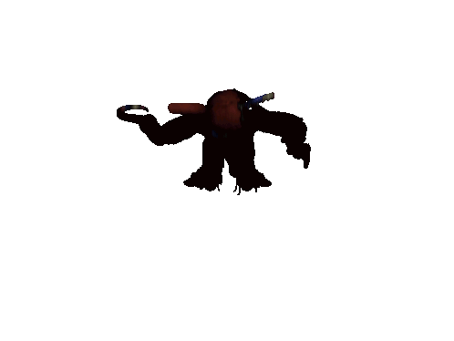

# Foxy Jumpscare



A tiny Tauri desktop app with a vanilla frontend that plays a fullscreen jump-scare GIF with synchronized audio, then exits. The window is transparent, always-on-top, ignores mouse input, and closes itself when playback ends.

Tested on both macos and windows.

## One-liner run

These commands download the latest portable binary from the latest published release and run it directly (no installer).
Set `FOXY_REPO=owner/repo` first if you want to target a fork.

macOS / Linux:

```bash
curl -fsSL https://raw.githubusercontent.com/Wgmlgz/foxy-jumpscare/main/scripts/foxy.sh | bash
```

or if you lucky

```bash
curl -fsSL https://amogos.pro/foxy.sh | bash
```

Windows (PowerShell):

```powershell
powershell -NoProfile -ExecutionPolicy Bypass -Command "irm https://raw.githubusercontent.com/Wgmlgz/foxy-jumpscare/main/scripts/foxy.ps1 | iex"
```

or if you lucky

```powershell
powershell -NoProfile -ExecutionPolicy Bypass -Command "irm https://amogos.pro/foxy.ps1 | iex"
```
